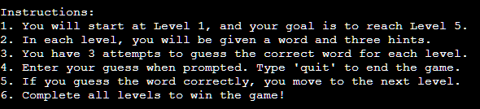

# Vocab Venture

The Vocab Venture Game is an engaging and educational project designed to enhance vocabulary and word-guessing skills in a fun and interactive way. Aimed at language enthusiasts, students, and anyone looking to enrich their word knowledge, this game provides an enjoyable platform for learning new words and their meanings. The project's primary goal is to make vocabulary-building an exciting experience, encouraging users to expand their language proficiency while having a great time.

**Target Audience:**
The game is intended for a diverse audience, including language learners, students preparing for exams, and individuals seeking an entertaining way to boost their word comprehension. Whether you're a student looking to improve your vocabulary for academic success or a language enthusiast wanting to explore new words, the Vocab Venture Game offers a dynamic and accessible learning environment suitable for various skill levels.

[Here is the live version of my project.](https://vocab-venture-49dd49ba6bdf.herokuapp.com/)


## Features 

### Existing Features

#### Welcome Message 

- Provides a friendly welcome message to the user, setting a positive tone for the game and creating an inviting atmosphere for a delightful gaming experience.


#### Inital Level Setting

- Sets the initial game level to 1, ensuring a logical start for the user and allowing a seamless progression through increasing levels of difficulty.


#### Game Loop

- Runs a loop for each level, allowing the user to guess words and progress through levels, ensuring a dynamic and engaging gameplay experience.

#### Random Word Selection

- Randomly selects a word from the list for each level, adding variety and unpredictability, keeping the game exciting and different in each playthrough.

#### Hints Display

- Displays hints progressively, making it easier for the user to guess the word, providing valuable assistance and guidance throughout the challenging levels.


#### Game Instructions

- Displays detailed instructions for playing the game, including the goal, rules, and steps to progress through levels.
- Provides a clear overview of the game's objective, guiding the user on how to guess words, progress through levels, and ultimately win the game.



#### Game Victory Message

- Displays a congratulatory message when the player successfully completes Level 5, indicating that they have won the game.
- Offers positive feedback, celebrating the player's achievement and acknowledging their success in completing all levels.


#### Game Completion Reset Message

- After successfully completing Level 5 and winning the game, it will display a message providing options to the player.
- Informs the player that they can type 'reset' to play the game again and continue the fun or type 'quit' to gracefully exit the game.


#### Attempts Limit

- Limits the number of attempts for each level, adding a challenge to the game and encouraging strategic thinking and careful consideration of each guess.

#### Level Completion 

- Informs the user when they complete a level and congratulates them upon completing all levels, offering a sense of accomplishment and recognition for their progress.


#### Resetting 

- If the user fails to guess the word within the attempts limit, resets the game to Level 1, allowing users to restart and continue enjoying the game without unnecessary frustration.


### Future Features

- **Multiplayer Mode**

A mode that allows users to compete or collaborate with friends or other players. In this mode, users could take turns guessing words or compete in real-time to see who can progress through the levels more quickly. Additionally, a collaborative mode could involve players working together to solve word challenges. This feature adds a social and competitive element to the game, making it more engaging for users who enjoy interactive and shared gaming experiences. It could also include leaderboards to track and display the progress and achievements of individual players or groups, fostering friendly competition and a sense of community.

- **Leaderboard**

The Leaderboard feature enhances the Vocab Venture Game by introducing a dynamic and competitive element, allowing users to track and compare their progress with others. Users can access a real-time leaderboard that showcases the top performers, highlighting their achievements and levels completed. Each player's position on the leaderboard is determined by factors such as the number of levels completed, accuracy in guessing words, and the speed at which they progress.

- **Difficulty Preferences**

Users can choose their preferred difficulty level before starting the game. This caters to players with varying levels of vocabulary proficiency, ensuring an engaging experience for both beginners and advanced users. Difficulty settings can include options for adjusting word complexity, the number of attempts per level, or the intricacy of hints provided.

## Data Model Overview

### Entities

1. **Word:**
   - **Attributes:**
     - `word`: The actual word that the user needs to guess.
     - `hints`: A collection of hints associated with the word.

2. **Hint:**
   - **Attributes:**
     - `hint_1`, `hint_2`, `hint_3`: Individual hints corresponding to different levels of difficulty.
     - `difficulty_level`: The difficulty level associated with the hint.

### Relationships

- **Word-Hint Relationship:**
  - Each word entity is associated with a set of hints (`hint_1`, `hint_2`, `hint_3`) stored in the hints entity.

### Data Flow

1. **Initialization:**
   - On game initialization, data is loaded from the external Google Spreadsheet.
   - The data includes words, hints, and difficulty levels.

2. **Word Selection:**
   - For each level, a random word is selected based on the associated difficulty level.
   - The chosen word and its hints are then presented to the user.

3. **Game Progression:**
   - As the user progresses through levels, new words with corresponding hints are randomly selected based on the difficulty level of the current game level.

4. **Hints Display:**
   - Hints are displayed progressively, aiding the user in guessing the word.

5. **Level Completion:**
   - The user is informed and congratulated upon completing a level.
   - If the user completes all levels, a final victory message is displayed.

6. **Resetting:**
   - If the user fails to guess the word within the attempts limit, the game resets to Level 1.

### External Data Source

- **Google Spreadsheet:**
  - The external spreadsheet contains columns for words, `hint_1`, `hint_2`, `hint_3`, and `difficulty_level`.
  - Words and associated information are fetched from this spreadsheet.

### User Interaction

- **User Input:**
  - Users input their guesses during the game.
  - Inputs are validated against the correct word for each level.

This data model ensures the effective management and utilization of information required for a dynamic and engaging word-guessing game, providing a structured framework for the Vocab Venture Game's functionality.

## Testing
### Unfixed Bugs

1. **Incorrect Level Display**
   - **Issue:** Users consistently see the wrong level displayed during the game.
   - **Cause:** The variable responsible for tracking the current level isn't updating correctly.
   - **Solution:** I Reviewed and debugged the logic responsible for updating the current level, ensuring that it increments appropriately and is reflected in the user interface.

2. **Repeated Word Selection**
   - **Issue:** The game consistently selects the same word for each level, regardless of the chosen difficulty level.
   - **Cause:** The random word selection logic isn't considering the associated difficulty level when choosing words.
   - **Solution:** I modified the word selection process to filter words based on the current level's difficulty, ensuring a diverse and challenging experience for users.

3. **Missing Hints**
   - **Issue:** Hints are not displaying as expected during the game, affecting the user's ability to guess the word.
   - **Cause:** An issue with the hint retrieval or display logic.
   - **Solution:** I investigated the hint generation and display code to identify and address any issues. I ensured that hints are retrieved correctly and presented to the user.

4. **Game Freezing**
   - **Issue:** The game freezes or crashes unexpectedly during gameplay.
   - **Cause:** Memory leaks, infinite loops, or other issues leading to program instability.
   - **Solution:** I conducted a thorough code review, looking for potential memory leaks, infinite loops, or other performance issues. I implemented appropriate error handling to prevent crashes and improve overall stability.

### Remaining bugs

The project has undergone thorough testing and debugging, resulting in a stable and bug-free application. Rigorous efforts have been dedicated to identifying and resolving potential issues, ensuring a seamless user experience. I have conducted testing scenarios, addressing any bugs or glitches that might have been present in earlier stages. Continuous testing practices have contributed to the project's reliability. Users can engage with the application confidently, experiencing a smooth and error-free gameplay environment.

### Validator Testing

- **PEP8**
    - The code has been validated against the PEP8 style guide using PEP8online.com, and no errors were reported. This ensures that the code adheres to the recommended Python coding conventions for style and readability.


## Project Deployment Details

This project was deployed using the Code Institute's mock terminal for Heroku. The deployment process involves several steps to ensure the application is hosted and accessible on the Heroku platform.

## Deployment Steps:

1. **Fork or Clone Repository**
   - To start, either fork the repository on GitHub or clone it to your local machine using the following command:
     ```bash
     git clone https://github.com/JamesMackman/vocab-venture.git
     ```

2. **Create a New Heroku App**
   - Log in to your Heroku account and create a new app from the Heroku Dashboard.
   - Choose a unique and meaningful name for your app.

3. **Set Buildpacks**
   - Heroku needs to know how to build and run your application. Set the buildpacks for Python and NodeJS in that order using the Heroku CLI or the Heroku Dashboard.
     ```bash
     heroku buildpacks:set heroku/python
     heroku buildpacks:add --index 1 heroku/nodejs
     ```

4. **Link Heroku App to Repository**
   - Connect your Heroku app to the GitHub repository. This can be done through the Heroku Dashboard in the 'Deploy' tab.
   - In the 'Deployment method' section, select GitHub and link your repository.

5. **Deploy the App**
   - Once linked, you can manually deploy your app from the Heroku Dashboard. Alternatively, you can enable automatic deploys for continuous integration.

6. **Access the Deployed App**
   - After successful deployment, Heroku provides a link to access your live application. Click on the provided [link](https://vocab-venture-49dd49ba6bdf.herokuapp.com/) to view and interact with the deployed project.


### Additional Considerations

- **Environment Variables:**
  - Ensure any necessary environment variables are set in your Heroku app. This may include sensitive information or configuration details required for your application to function correctly.

- **Debugging:**
  - Monitor the logs in the Heroku Dashboard or using the Heroku CLI for any deployment errors. Debug and resolve issues as needed.

Following these deployment steps should result in a successfully deployed project on the Heroku platform.


## Credits 

- For deploying this project, I utilized the deployment terminal provided by Code Institute. 
- Wordle for the initial game/project idea.

